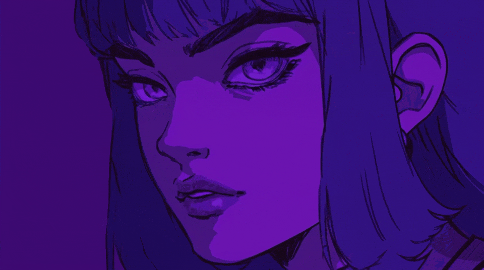

  

 

  
  
  
  

  

---

## GitHub Analytics

  

---

<picture>
  <source media="(prefers-color-scheme: dark)" srcset="https://raw.githubusercontent.com/wenura2/wenura2/output/pacman-contribution-graph-dark.svg">
  <source media="(prefers-color-scheme: light)" srcset="https://raw.githubusercontent.com/wenura2/wenura2/output/pacman-contribution-graph.svg">
  
</picture>

---

## Current Focus

- Building polished game experiences
- Improving UI/UX skills
- Creating stronger portfolio projects
- Growing as a multidisciplinary developer

---

  Designed by Wenura

