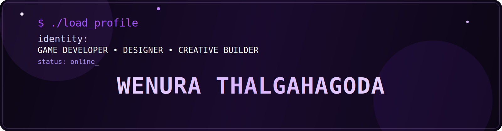

<h1>Wenura Thalgahagoda</h1>
<h3>Creative Developer • UI/UX Designer • Illustrator</h3>

  

  
  

---

## About Me

I’m a creative-minded developer who enjoys blending **technology, design, and storytelling** into interactive experiences.

My focus includes:
- Game development
- UI/UX design
- Software engineering
- Digital illustration
- Creative project building

---

## Socials

  
  
  
  

---

## Tech Stack

  

---

## GitHub Analytics

  
  

  

---

## Contribution Snake

  

---

## Current Focus

- Building polished game experiences
- Improving UI/UX skills
- Creating stronger portfolio projects
- Growing as a multidisciplinary developer

---

  Designed by Wenura

